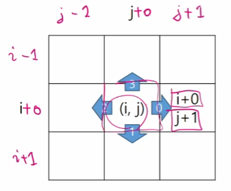
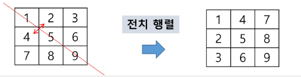

# 20240131 필기_2차원 배열

## 2차원 배열

### 2차원 배열의 선언
- 2차원 배열이란 1차원 List를 묶어놓은 List
- 2차원 이상의 다차원 List는 차원에 따라 Index를 선언
- 2차원 List의 선언 : 세로 길이(행의 개수), 가로 길이(열의 개수)를 필요로 함
- Python에서는 데이터 초기화를 통해 변수선언과 초기화가 가능함
- `arr = [[0, 1, 2, 3], [4, 5, 6, 7]]`

```python
# 1 2 3 
# 4 5 6
# 7 8 9
arr = [list(map(int, input().split()))for _ in range(3)]
```
[**코드**](./code/arr2.py)

---

### 2차원 배열의 접근
#### 배열 순회
n * m 배열의 n*m개의 모든 원소를 빠짐없이 조사하는 방법

```python
# 행 우선 순회

# i : 행의 좌표
# j : 열의 좌표
for i in range(n):
  for j in range(m):
    f(array[i][j])  # 필요한 연산 수행


# 열 우선 순회
for j in range(m):
  for i in range(n):
    f(array([i][j]))  # 필요한 연산 수행


# 지그재그 순회
# ---->
# <----
# ----> 순서로 순회

for i in range(n):
  for j in range(m):
    f(array[i][j + (m-1-2*j) * (i%2)])
```

### 델타를 이용한 2차 배열 탐색
- 2차 배열의 한 좌표에서 4방향의 인접 배열 요소를 탐색하는 방법
- 인덱스 (i, j)인 칸의 상하좌우칸(ni. nj)


```ps
di[] <- [0, 1, 0, -1]  # 방향별로 더할 값
di[] <- [1, 0, -1, 0]

for k : 0 -> 3
ni <- i + di[k]
nj <- j + dj[k]
```
```py
arr[0...N-1][0...N-1] # NxN 배열
dj[] = [0,1,0,-1]
dj[] = [1,0,-1,0]
for i: 0 -> N-1
  for j: 0 -> N-1:
    for k in range(4):
      ni <- i + di[k]
      nj <- j + dj[k]
      if 0 <= ni and 0 <= nj < N   # 유효한 인덱스라면
        f(arr[ni][nj])
```
[코드](./code/delta.py)

---
### 전치 행렬



```py
# i : 행의 좌표, len(arr)
# j : 열의 좌표, len(arr[0])
arr = [[1, 2, 3], [4, 5, 6], [7, 8, 9]] # 3*3 행렬

for i in range(3):
  for j in range(3):
    if i < j:
      arr[i][j], arr[j][i] = arr[j][i], arr[i][j]
```