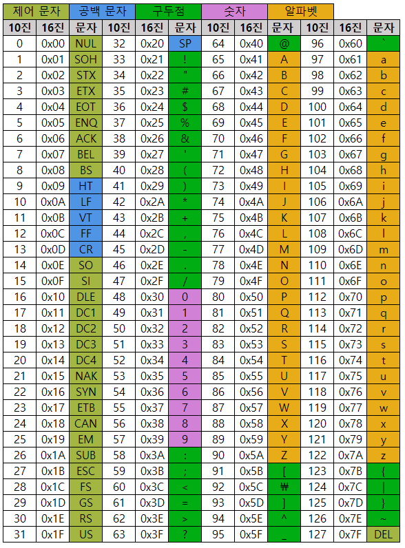

# 20240205 문자열 필기

## 컴퓨터에서의 문자표현
- 글자 A를 메모리에 저장하는 방법에 대해서 생각해보자
- 메모리는 숫자만을 저정할 수 있기 때문에 A라는 글자의 모양 그대로 비트맵으로 저장하는 방법(이러면 메모리 낭비가 심함)을 사용하지 않는 한 각 문자에 대해서 대응하는 숫자를 정해놓고 이것을 메모리에 저장하는 방법이 사용될 것이다
- 영어가 대소문자 합쳐서 52이므로 6비트(2^6, 64)면 모두 표현할 수 있다.
- 그렇기에 문자열을 표현하는 표준을 정했다 : ASCII
- 7bit 인코딩으로 128문자를 표현하며, 33개의 출력 불가능한 제어 문자들과 공백을 비롯한 95개의 출력 가능한 문자들로 이루어져있다.

### 아스키 코드(ASCII)

### 확장 아스키
- 확장 아스키는 표준 문자 이외의 악센트 문자, 도형 문자, 특수 문자, 특수 기호 등 부가적인 문자를 128개 추가할 수 있게 하는 부호이다.
- 표준 아스키는 7bit를 사용하여 문자를 표현하는 데 비해 확장 아스키는 1Byte내의 8-bit를 모두 사용함으로써 추가적인 문자를 표현할 수 있다.
- 컴퓨터 생산자와 소프트웨어 개발자가 여려가지 다양한 문자에 할당할 수 있도록 하고 있다. 이렇게 할당된 확장 부호는 표준 아스키와 같이 서로 다른 프로그램이나 컴퓨터 사이에 교환되지 못한다.
- 그러므로 표준 아스키는 마이크로컴퓨터 하드웨어 및 소프트웨어 사이에서 세계적으로 통용되는데 비해, 확장 아스키는 프로그램이나 컴퓨터 또는 프린터가 그것을 해독할 수 있도록 설계되어 있어야먄 올바로 해독될 수 있다.

### 유니코드
- 다국어 처리를 위한 표준
- 유니코드도 Character Set으로 분류된다
  - UCS-2(Universal Character Set 2)
  - UCS-4(Universal Character Set 4)
- 유니코드를 저장하는 변수의 크기를 정의
- 그러나, 바이트 순서에 대해서 표준화하지 못했음
- 다시 말해 파일을 인식 시 이 파일이 UCS-2, UCS-4인지 인식하고 각 경우를 구분해서 모두 다르게 구현해야하는 문제 발생
- 그래서 유니코드의 적당한 외부 인코딩이 필요하게 되었다

### 유니코드 인코딩(UTF)
- UTF-8(in web)
  - MIN : 8bit, MAX : 32bit
- UTF-16 (in windows, java)
  - MIN : 16bit, MAX : 32bit
- UTF-32 (in unix)
  - MIN : 32bit, MAX : 32bit

### 파이썬 인코딩
- 2.x 버전 : ASCII -> #-*- coding: utf-8 -*- (첫 줄에 명시)
- 3.x 버전 : 유니코드 UTF-8 (생략 가능)
- 다른 인코딩 방식으로 처리시 첫 줄에 작성하는 위 항목에 원하는 인코딩 방식을 지정해주면 됨

---

## 문자열
- 문자열의 분류
  - fixed length
  - variable length
    - length controlled : java에서의 문자열
    - delimited : c에서의 문자열

### java에서 string 클래스에 대한 메모리 배치 예
- java.lang.String클래스에는 기본적인 객체 메타 데이터 외에도 네가지 필드들이 포함되어 있는데, hash값, 문자열의 길이(count), 문자열 데이터의 시작점(offset), 그리고 실제 문자열 배열에 대한 참조(value)이다.

### c언어에서의 문자열 처리
- 문자열은 문자들의 배열 형태로 구현된 응용 자료형
- 문자배열에 문자열을 저장할 때는 항상 마지막에 끝을 표시하는 널문자('\0')를 넣어줘야 한다.
  - ex) char ary[] = {'a', 'b', 'c', '\0'};
  - char ary[] = "abc";
- 문자열 처리에 필요한 연산을 함수 형태로 제공한다.

### 두 코드의 차이
- s1 = list(input())
- s2 = input()
s1은 한 글자씩 나뉘어 리스트에 들어감. s2는 하나의 문자열로 저장됨

### Python에서의 문자열 처리
- char타입 없음
- 텍스트 데이터의 취급방법이 통일되어 있음
- 문자열 기호
  - ', ", ''', """
  - \+ : 연결, 문자열을 이어붙여줌
  - \* : 반복
- 문자열은 시퀀스 자료형으로 분류되고, 시퀀스 자료형에서 사용할 수 있는 인덱싱, 슬라이싱 연산들을 사용할 수 있음
- 문자열 클래스에서 제공되는 메소드
  - replace(), split(), isalpha(), find() 등
- 문자열은 튜플과 같이 요소값을 변경할 수 없음(immutable)

### C와 Java의 String처리의 기본적인 차이점
- c는 아스키 코드로 저장한다
- java는 유니코드(UTF16, 2byte)로 저장한다
- 파이썬은 유니코드(UTF8)로 저장

### 문자열 뒤집기
- 자기 문자열에서 뒤집는 방법이 있고, 새로운 빈 문자열을 만들어 소스의 뒤에서부터 읽어서 타겟에 쓰는 방법이 있다.
- 자기 문자열을 이용할 경우는 swap을 위한 임시 변수가 필요하며, 반복 수행을 문자열 길이의 반만을 수행해야 한다.

### 문자열 연습
[문자열 연습 코드](문자열.py)