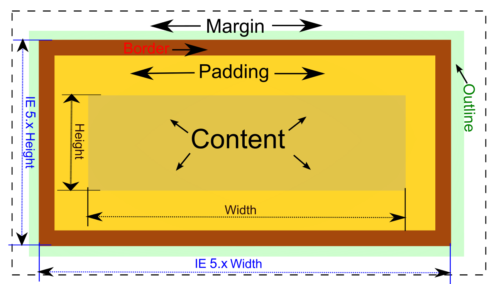

# 20240307 CSS Layout 필기

## CSS Box Model
모든 HTML 요소를 사각형 박스로 표현하는 개념

### 구성요소
- 내용(content) : 콘텐츠가 표시되는 영역
- 안쪽 여백(padding) : 콘텐츠 주위에 위치하는 공백 영역
- 테두리(border) : 콘텐츠와 패딩을 감싸는 테두리 영역
- 외부 간격(margin) : 이 박스와 다른 요소 사이의 공백. 가장 바깥쪽 영역

**BOX 구성의 방향 별 명칭**  
[예제 코드](./02-box-model
/01-part-of-box.html)

### width & height
- 요소의 너비와 높이를 지정
- 이때 지정되는 요소의 너비와 높이는 콘텐츠 영역을 대상으로 함
- -> border(box)가 아닌 content의 크기를 width 값으로 지정
- 이를 조절하기 위해 box-sizing 속성을 사용
  - `box-sizing : content-box;` : 콘텐츠 기준
  - `box-sizing : border-box;` : 테두리 기준 (일반적으로 레이아웃 만들 때 사용)

[예시 코드](./02-box-model
/02-box-sizing.html)

---
### 박스 타입
- block
- inline

#### Normal flow
CSS를 적용하지 않았을 경우 웹페이지 요소가 기본적으로 배치되는 방향
- 좌우 방향 : Inline Direction
- 상하 방향 : Block Direction 

[예시 코드](./02-box-model
/03-block-inline.html)  
(파란 색으로 칠해진 영역은 block 요소, 빨간색으로 칠해진 영역은 inline요소)

### block 타입 특징
- 항상 새로운 행으로 나뉨
- width와 height 속성을 사용하여 너비와 높이를 지정할 수 있음
- 기본적으로 width 속성을 지정하지 않으면 박스는 inline 방향으로 사용 가능한 공간을 모두 차지함 (너비를 사용가능한 공간의 100%로 채우는 것)
- 대표적인 block 타입 태그
  - h1~6, p, div

### inline 타입 특징
- 새로운 행으로 나뉘지 않음
- width와 height 속성을 사용할 수 없음
- 수직 방향
  - padding, margins, borders가 적용되지만 다른 요소를 밀어낼 수는 없음
- 수평 방향
  - padding, margins, borders가 적용되어 다른 요소를 밀어낼 수 있음
- 대표적인 inline 타입 태그
  - a, img, span

### 속성에 따른 수평 정렬
- margin-right : auto; -> text-align : left;
- margin-left : auto; -> text-align : right;
- margin : auto; -> text-align : center;

### 기타 속성

#### inline-block
- inline과 block 요소 사이의 중간 지점을 제공하는 display 값
- block 요소의 특징을 가짐
  - width 및 height 속성 사용 가능
  - padding, margin 및 border로 인해 다른 요소가 밀려남
- 요소가 줄 바꿈 되는 것을 원하지 않으면서 너비와 높이를 적용하고 싶은 경우에 사용

[예시코드](./02-box-model/04-inline-block.html)

#### none
- 요소를 화면에 표시하지 않고, 공간조차 부여되지 않음
- 주로 반응형 레이아웃에 사용됨

[예시코드](./02-box-model
/05-none.html)

### 참고
#### shorthand 속성 border
`border : 2px solid black;`
- border-width, border-style, border-color를 한번에 설정하는 속성
- 순서는 영향을 주지 않음

#### shorthand 속성 margin, padding
4방향의 속성을 각각 지정하지 않고 한번에 지정할 수 있는 속성
- 4개 : 상우하좌
- 3개 : 상/좌우/하
- 2개 : 상하/좌우
- 1개 : 공통

#### Margin collapsing(마진 상쇄)
- 두 block타입 요소의 margin top과 bottom이 만나 더 큰 margin으로 결합되는 현상
- 웹 개발자가 레이아웃을 더욱 쉽게 관리할 수 있도록 함
- -> 각 요소에 대한 상/하 margin을 각각 설정하지 않고 한 요소에 대해서만 설정하기 위함

## CSS Position
CSS Layout : 각 요소의 위치와 크기를 조정하여 웹 페이지의 디자인을 결정하는 것
- Display : block, inline
- Position : 요소를 Normal Flow에서 제거하여 다른 위치로 배치하는 것. 다른 요소위에 올리기, 화면의 특정 위치에 고정시키기 등 가능
- Float : 오래 되어서 잘 쓰지 않음
- Flexbox : 최신 기술

### Position 이동 방향
- top, left, bottom, right, z-axis

### Position 유형
- static
  - 기본값
  - 요소를 Normal Flow에 따라 배치
- relative
  - 요소를 Normal Flow에 따라 배치
  - 자기 자신을 기준으로 이동
  - 요소가 차지하는 공간은 static일 때와 같음
- absolute
  - 요소를 Normal Flow에서 제거
  - 가장 가까운 relative 부모 요소를 기준으로 이동 (static이 아닌 부모)
  - 문서에서 요소가 차지하는 공간이 없어짐
- fixed
  - 요소를 Normal Flow에서 제거
  - 현재 화면영역(viewpoint)를 기준으로 이동
  - 문서에서 요소가 차지하는 공간이 없어짐
- sticky
  - 요소를 Normal Flow에 따라 배치
  - 요소가 일반적인 문서 흐름에 따라 배치되다가 스크롤이 특정 임계정에 도달하면 그 위치에서 고정됨(fixed)
  - 만약 다음 sticky 요소가 나오면 다음 sticky 요소가 이전 sticky 요소의 자리를 대체
    - 이전 sticky 요소가 고정되어 있던 위치와 다음 sticky 요소가 고정되어야 할 위치가 겹치기 때문

[예시코드](./03-css-layout-position/01-position.html)  
[sticky 예시코드](./03-css-layout-position/02-sticky.html)  
[absolute 예시코드](./03-css-layout-position/03.absolute.html)

#### z-index
요소가 겹쳤을 때 어떤 요소 순으로 위에 나타낼지 결정  
[예시코드](./03-css-layout-position/04-z-index.html)
- 특징
  - 정수 값을 사용해 Z축 순서를 지정
  - 더 큰 값을 가진 요소가 작은 값의 요소를 덮음
  - 맨 위에 표시되어야 한다면 그냥 큰 숫자를 줌

#### Position의 역할
전체 페이지에 대한 레이아웃을 구성하는 것이 아닌 페이지 특정 항목의 위치를 조정하는 것

## CSS Flexbox
요소를 행과 열 형태로 배치하는 1차원 레이아웃 방식 -> 공간 배열 & 정렬

### 구성 요소

- Flex Container : 부모. 얘를 기준으로 배치

#### main axis (주 축)
- flex item들이 배치되는 기본 축
- 왼쪽에서 시작해서 오른쪽으로 흐름
- main start에서 시작해서 main end 방향으로 배치(기본 값)

#### cross axis (교차 축)
- main axis에 수직인 축
- cross start에서 시작하여 cross end 방향으로 배치 (기본 값)

#### Flex Container
- `display : flex;` 혹은 `display : inline-flex;`가 설정된 부모 요소
- 이 컨테이너의 1차 자식 요소들이 Flex Item이 됨
- flexbox 속성 값들을 사용하여 자식 요소 Flex Item들을 배치하는 주체

#### Flex Item
- Flex Container 내부에 레이아웃 되는 항목  

### 레이아웃 구성
[예시코드](./04-css-layout-flexible-box/01-flexbox.html)
#### 1. Flex Container 지정
- flex item은 기본적으로 행(주 축의 기본값인 가로 방향)으로 나열
- flex item은 주 축의 시작 선에서 시작
- flex item은 교차 축의 크기를 채우기 위해 늘어남

#### 2. flex-direction
- flex item이 나열되는 방향을 지정
- column으로 지정할 경우 주 축이 변경됨
- "-reverse"로 지정하면 flex item 배치의 시작 선과 끝 선이 서로 바뀜

#### 3. flex-wrap
- flex item 목록이 flex container의 한 행에 들어가지 않을 경우 다른 행에 배치할지 여부 설정

#### 4. justify-content
- 주 축을 따라 flex item과 주위에 공간을 분배

#### 5. align-content
- 교차 축을 따라 flex item과 주위에 공간을 분배
  - flex-wrap이 wrap또는 wrap-reverse로 설정된 여러 행에만 적용됨
  - 한 줄 짜리 행에는 효과 없음(flex-wrap이 nowrap으로 설정된 경우)

#### 6. align-items
- 교차 축을 따라 flex item 행을 정렬

#### 7. align-self
- 교차 축을 따라 개별 flex item을 정렬

### Flexbox 속성
- Flex Container 관련 속성
  - display, flex-direction, flex-wrap, justify-content, align-items, align-content
- Flex Item 관련 속성
  - align-self, flex-grow, flex-basis, order

#### 8. flex-grow
- 남는 행 여백을 비율에 따라 각 flex item에 분배
  - 아이템이 컨테이너 내에서 확장하는 비율을 지정
- flex-grow의 반대는 flex-shrink

[예시코드](./04-css-layout-flexible-box/02-flexbox-grow.html)

#### 9. flex-basis
- flex item의 초기 크기 값을 지정
- flex-basis와 width 값을 동시에 적용한 경우 flex-basis가 우선

[예시코드](./04-css-layout-flexible-box/03-flexbox-basis.html)

### flex-wrap 응용

#### 반응형 레이아웃
다양한 디바이스와 화면 크기에 자동으로 적응하여 콘텐츠를 최적으로 표시하는 웹 레이아웃 방식

[예시코드](./04-css-layout-flexible-box/04-flexbox-responsive.html)